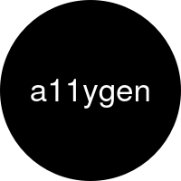

  

<h1 align="center">a11ygen</h1>

---

 Generate a palette of accessible colors with borders and background.
     

Given a text and background colors, `a11ygen` will generate a palette of
accessible colors *in the same hue* for borders and backgrounds.

## Features

- SASS implementation. Can be included as a library.

[See example](https://alexskrypnyk.github.io/a11ygen/)

## Roadmap

- [ ] Add support for light and dark backgrounds
- [ ] Add JS implementation
